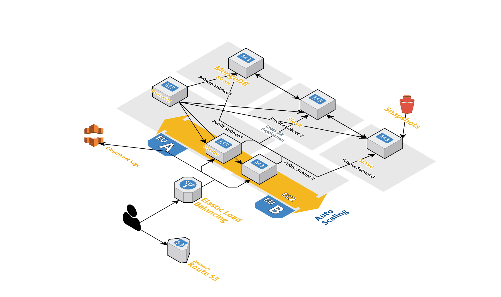

Install
-------

::

    # clone the repository
    $ git clone https://github.com/DenysTT/revolut_api.git

Build
-----

::

    # build docker image
    $ make build release=latest

Push
----

::

    # push docker image to repository
    $ make push release=latest

Run
---

::

    # to run locally (Dockerfile will be used)
    $ docker-compose up -d
    # to run on the cloud (image from the repo will be used in this case)
    $ docker-compose -f docker-compose-remote.yml

Open http://127.0.0.1:5000 in a browser.

Tests
----

::

    # run the following command to trigger tests
    $ docker exec -it revolut_api_app_1 pytest

System Diagram
-------------

::

    * For QA/UAT instances only one Spotinst host will be used ($$$)
    * All infrastructure will be stored in Cloudformation/Terraform templates
    * I didn't display there CD hosts, GIT, LDAP and etc (which will be definetly present in real life)

No Downtime deploys
-------------------

::

    One of the possible approaches 
    # 1) Jenkins will trigger ansible playbook (DB and Application will be in galaxy-roles)
    # 2) Hosts will be updated one by one
    # 3) After updating one hosts post deployment tests will be triggered, and if tests fails deployment won't be processed
    further to second host
    # * During update ELB or reverse proxy LB will decide where to route traffic (based on health checks) so if let say
    first host is updating and health check from this node is absent all traffic will be routed to host2

